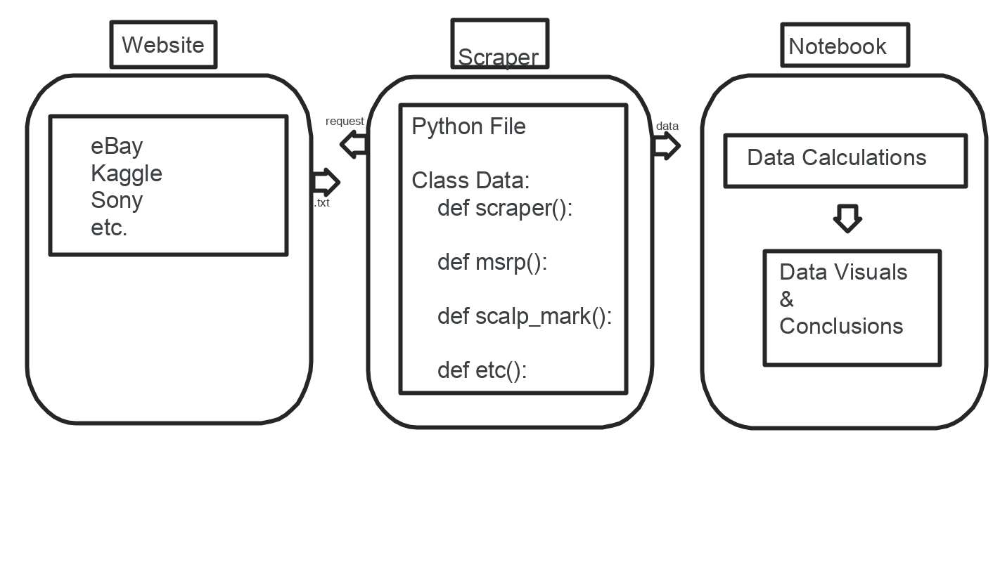

# Scalper Project

## Authors:

Lee Thomas, Taylor Johnson, Alex Pena, Paul Leonard

## Overview:

The global pandemic is severely limiting the supply chain, and this has caused a massive rise to scalpers. Scalpers are people who buy a product with no intention of using it, only to turn around and sell the product online for double, triple, or quadruple its msrp. A scalpers goal is to take advantage of the products hype and limit of the supply chain for a quick profit. We will be using a web scraper to find the inflated prices of scalped products and graph them against the msrp. We will find historical data of similar scalped products and graph them as well. Then, we can compare the pre-covid scalping to todays scapling, amisdst a disrupted supply chain, and observe any differences.

## Wireframe

## Version 1.0.0

Basic scaffolding and dependencies.
## User Stories

**Price Check:**
As a consumer I want to see the current cost of an out-of-stock new product compared to its MSRP so I can choose to buy or not as an informed consumer.
Feature Tasks:
- Research product MSRP
- Scrape web for current average listing price
- Create CSV of price data
- Graph current prices vs MSRP in Notebook
Acceptance Tests:
- Able to find MSRP
- Able to scrape secondary market sites for prices
- Able to produce CSV a file with appropriate scraped data
- Able to generate graph in Jupyter Notebook

**Price History:**
As a consumer I want to know the historical trend in price scalping so I can understand what is happening today.
Feature Tasks:
- Research historical cases of product scalping
- Import historical data as CSV
- Present historical price trend vs current prices
Acceptance Tests:
- Able to find historical scalping data
- Able to import CSV
- Able to create visual comparison of historical vs current

**Price Change:**
As a consumer I want a graph so that I can see the price change over time of a product.
Feature Tasks:
- Create specific data sets from CSV
- Create graph to plot price change over time
Acceptance Tests:
- Able to extract price and time data from CSV
- Able to produce graph of price over time

**Inflated Price Perspective:**
As a user I want an app that will show me what scalping of common household items would look like so I can put the scalped prices into perspective.
Feature Tasks:
- Create a data visualization that shows a common consumer product and produces a scalped price based on current scalping trends.
- Create app that takes in a product and a price and produces a scalped price based on current scalping trends. (stretch goal)
Acceptance Tests:
- Able to display a sample of a different consumer item.
- Able to take user input (stretch goal)
- Able to make calculation on user input (stretch goal)
- Able to output scalped price to user. (stretch goal)

**Time to Settle:**
As a user I want to know how long I have to wait for an inflated price to return to MSRP so that I can save money. 
Feature Tasks:
- Research time price data of products that have come down from a scalpers high.
- Graph trend in price descents back to MSRP
- Make conclusion based on data
- Present user average time of price to return to MSRP
- Make prediction of when product will return to MSRP (linear regression)
Acceptance Tests:
- Able to find data of price hike and fall
- Able to produce graph of product cycles
- Able to present conclusion in Notebook
- Able to present prediction of current products price cycle
